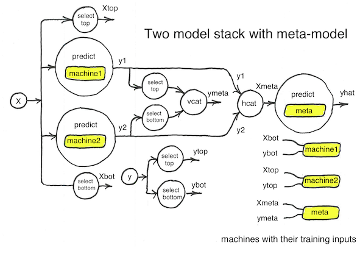

## MLJ

A pure Julia machine learning framework.

[](https://travis-ci.com/alan-turing-institute/MLJ.jl)
[](https://slackinvite.julialang.org/)



MLJ aims to be a flexible framework for combining and tuning machine
learning models, written in the high performance, rapid development,
scientific programming language, [Julia](https://julialang.org). MLJ
is work in progress and new collaborators are being sought. 

Click [here](CONTRIBUTE.md) if your are interested in contributing.

The MLJ project is partly inspired by [MLR](https://mlr.mlr-org.com/index.html) ([recent
slides 7/18](https://github.com/mlr-org/mlr-outreach).) For an earlier proof-of-concept, see
[this branch](https://github.com/alan-turing-institute/MLJ.jl/tree/poc)
and [this poster summary](material/MLJ-JuliaCon2018-poster.pdf).

Packages wishing to implement the MLJ interface for their algorithms should
import [MLJBase](https://github.com/alan-turing-institute/MLJBase.jl).


### Features to include:

- **Automated tuning** of hyperparameters, including
  composite models with *nested parameters*. Tuning implemented as a
  wrapper, allowing composition with other meta-algorithms. &#10004;

- Option to tune hyperparameters using gradient descent and **automatic
	differentiation** (for learning algorithms written in Julia).

- **Data agnostic**: Train models on any data supported by the Tables.jl 
[interface](https://github.com/JuliaData/Tables.jl). &#10004;

- Intuitive syntax for building arbitrarily complicated
  **learning networks** .&#10004;
  
- Learning networks can be exported as self-contained **composite models** &#10004;, but
  common networks (e.g., linear pipelines, stacks) come ready to plug-and-play.

- Performant parallel implementation of large homogeneous **ensembles**
  of arbitrary models (e.g., random forests). &#10004;

- **Task** interface matches machine learning problem to available models.

- **Benchmarking** a battery of assorted models for a given task.

- Automated estimates of cpu and memory requirements for given task/model.


### Requirements

* Julia 1.0 or higher


### Installation

In the Julia REPL:

````julia
]add "https://github.com/wildart/TOML.jl"
add "https://github.com/alan-turing-institute/MLJBase.jl"
add "https://github.com/alan-turing-institute/MLJModels.jl"
add "https://github.com/alan-turing-institute/MLJ.jl"
````

### Getting started

[Get started](doc/getting_started.md) with MLJ, or [take a tour](doc/tour.ipynb) of some of the features implemented so far.


### History

Predecessors of the current package are
[AnalyticalEngine.jl](https://github.com/tlienart/AnalyticalEngine.jl)
and [Orchestra.jl](https://github.com/svs14/Orchestra.jl), and
[Koala.jl](https://github.com/ablaom/Koala.jl). Work
continued as a research study group at the University of Warwick,
beginning with a review of existing ML Modules that were available in
Julia at the time ([in-depth](https://github.com/dominusmi/Julia-Machine-Learning-Review/tree/master/Educational),
[overview](https://github.com/dominusmi/Julia-Machine-Learning-Review/tree/master/Package%20Review)).


Further work culminated in the first MLJ
[proof-of-concept](https://github.com/alan-turing-institute/MLJ.jl/tree/poc)


